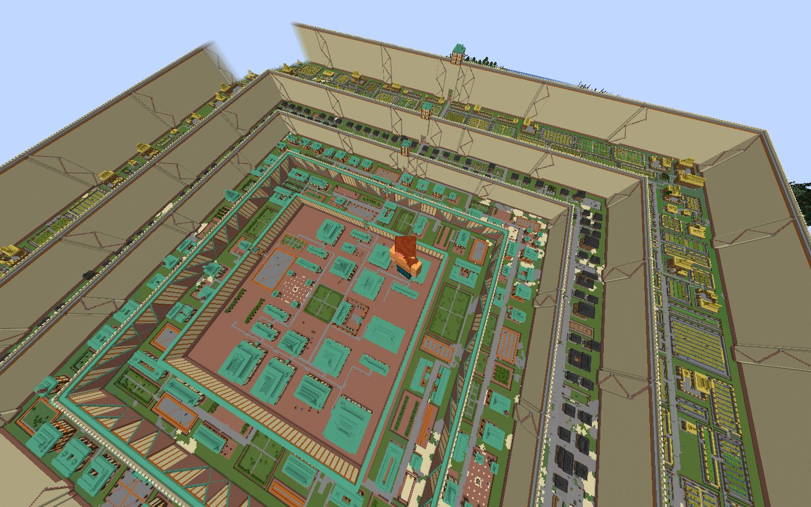

# EthosLM

**One sentence in, a finished place out.** Type "Build a walled town with a market and a
keep," or "Build a fishing village," and a complete settlement is planned, sited, built and
checked in a Minecraft world -- with no human anywhere in the loop. No coordinates, no size,
no style, no follow-ups, nothing for a person to fix afterwards. The system chooses where to
build, how large, in what palette, and lays every block itself.

The deliverable is the **architecture** that does that. It is general: the towns it builds
are probes of the architecture, not the product.

## Why Minecraft

Deterministic and discrete: a finite palette, an integer lattice, known physics, computable
lighting. Everything normally hard about 3D authoring -- topology, UVs, materials, shading,
continuous coordinates -- does not exist here. What is left is deciding which blocks go
where, and that is the whole problem.

## The architecture

**The model composes; the library builds.** A model reads the sentence and the ground and
writes short programs against a building library; the library emits the geometry. The model
decides *what* -- the place, the plan, the types, the palette. The library decides *how* --
every physical rule and the shell itself.

**A defect class dies when the library owns it.** Build a thing correctly *by construction*
and its failure mode never returns; merely *check* for it and it survives. Stair facing,
doors, entry, internal stairs, siting on any ground, water, the shell, the monument, the way
up to a storey -- each was a recurring defect until the library built it right, and none has
come back. The library grows by refusal: it says what it cannot yet do, and that is the next
primitive.

**A place is a tree of parts, and a type is a form.** A plan is a hierarchy -- a city of
rings of districts of plots, with walls as edges, gates as points, squares and fields as
areas. Each leaf is an instance of a *type*: a parametric generator per kind of part,
authored once, checked across seeds, sizes, ground and palettes, then instantiated for free
anywhere. A type declares what ground it needs and what it is for; it names no material,
taking the palette from the settlement's *voice*. A monument is not a big type -- it is a
**nested place**, planned recursively into halls, courts, an inner wall and gates, which is
also how a castle works.

**The builder can see, and correctness is proven offline.** Every authoring call carries the
real checker -- the linter and the walk model on the real cached ground -- and runs it as
often as it likes before finishing. Library correctness is proven deterministically: a
hand-written reference type over a bank of terrain fixtures, hundreds of instances at zero
model calls, in minutes. Model calls are for questions about the model, never for finding a
bug in the library.

**Two instruments, neither scores.** Deterministic checks catch *broken*, never *ugly*, and
are a frozen floor. A blinded, position-swapped pairwise judge says which of two builds is
better made. A person is the arbiter of *well* -- a diagnostic of what no check sees, and
never a stage of the loop.

**The harness is deterministic; only the content is not.** A run is a config file and one
command. Every stage, camera, judgement and record is code. A `--dry-run` builds the whole
place in memory with no server, so "prove it before you write it" is a rule a run can obey.

## Where it stands

A city stands from one sentence: concentric ring walls, gates, a density gradient from
farmland to a noble core, a monumental palace precinct, on green ground the system chose, in
a palette it wrote -- built, checked, walkable and rendered. What is left is quality polish.
"What is not finished" below is the honest list.

## Layout

    src/ethoslm/  the library, linter, walk model, judge, deterministic preview and the
                      model adapter; pipeline/ holds the staged driver (plan, build,
                      measure, media, the blinded authoring seam)
    types/            one file per kind of part: FORM, ROLE, KIND, PARAMS, NEEDS and
                      build(b, part, seed, **params). A part arrives already sited, carrying
                      the settlement's palette; a type names neither ground nor material
    voices/           one JSON per style: material roles, roof silhouette, prose for the
                      brief. Validated on load; the model may author one from a sentence
    rounds/           one JSON per run: the input, the flags, the thresholds registered
                      before it ran
    scripts/          round.py (run a config), check_types.py, type_needs.py,
                      terrain_bank.py, test_*.py (the offline suites), server scripts
    fixtures/         cached worlds and recorded plans the offline instruments stand on
    out/, run/        renders, caches, worlds, server -- never committed

## Running it

Linux or macOS, Python 3.12 or newer. On Windows, use WSL. On NixOS only, see **Native
libraries** at the end.

    python3 -m venv .venv
    .venv/bin/python -m pip install -r requirements.txt
    .venv/bin/python -m pip install --no-deps gdpc==8.1.0   # see requirements.txt
    source scripts/env.sh

**The offline suites.** No server, no model, no key. Every suite that writes blocks says so
and skips.

    for t in scripts/test_*.py; do "$PY" "$t" || echo "FAILED $t"; done

**A place, built offline from a shipped world.** A recorded plan on a cached world that ships
with the repository: sited, built out of the committed types, linted, with no server and no
model call anywhere in it. About three minutes.

    "$PY" scripts/round.py rounds/example.json --dry-run --stage parts,finish,lint

**A place from a sentence.** `rounds/town.json` is one sentence and nothing else -- no
coordinate, no size, no palette. This one calls a model, so read **Models** first.

    "$PY" scripts/round.py rounds/town.json --dry-run                  # no server
    bash scripts/mcrun.sh scripts/round.py rounds/town.json --live --wait

**Models.** By default every authoring call is staged for a supervising agent, which is the
path all of development ran on: the run stops, writes the request to disk, and continues when
an answer is there. To run headless, `models.json` maps each role -- the place spec, the
planner, type authoring, revision, the vision judge -- to a model, and `model.py` speaks the
Anthropic and OpenAI-compatible wire formats, so any hosted provider or local server works.
Set `ETHOSLM_MODEL_API` and a key, or override one role with `ETHOSLM_MODEL_<ROLE>`.

**The pipeline executes model-written Python.** That is the design -- the model composes
programs against the library -- and it means a run executes code a model wrote, in your
process, with your file system. Run it where that is acceptable: a container, a throwaway
user, a virtual machine.

**A server.** The live path needs Minecraft with the GDMC-HTTP mod on `localhost:9000`
(Fabric or NeoForge, GDMC-HTTP 1.8.4, WorldEdit 7.4.2, Minecraft 1.21.11). `scripts/mcrun.sh`
runs one session: server up, build, flush to disk, server down. Nothing offline needs it.

**Native libraries (NixOS only).** Put the store paths in an untracked `.env` (`NIX_GLIBC`,
`NIX_GCCLIB`, `NIX_ZLIB`) so the wheels can find them. Everywhere else the system supplies
them. `ETHOSLM_LIBRARY_PATH`, `ETHOSLM_PYTHON` and `ETHOSLM_JAVA` override the rest.

## Licence

MIT. See `LICENSE`.

<!-- PRINCIPAL: decisions to make before this is published.
     1. The clone line and any badges: no repository URL is written anywhere in this file.
     2. Asset and corpus licensing is unread and is a hard gate: Mojang's EULA, and the
        block-registry data in src/ethoslm/data/blocks_*.json, which was dumped from a
        server jar. Decide whether that file may ship as it is, be regenerated by the
        reader, or be replaced.
     3. Whether to publish the cached worlds and renders as a download, and under what
        terms; fixtures/ ships the small ones the suites need and nothing else.
     4. Whether to name the demo the system was built against anywhere in the public repo.
-->
