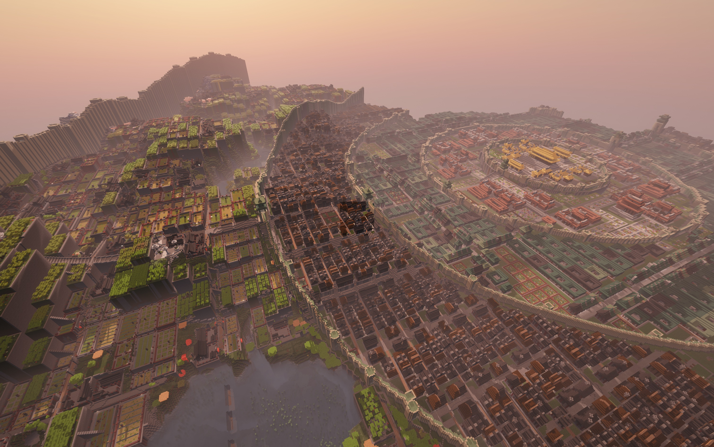

# EthosLM

Turn one sentence into a place in Minecraft.



You describe a place in plain English. An AI agent designs it on real terrain from your world. EthosLM builds every block and writes the result into your Minecraft save.

It can build anything from a small village to a large walled city.

## What you need

- Python 3.12 or newer.
- A Minecraft Java Edition save with generated terrain. Open it once in Minecraft and explore a bit so the land exists.
- A terminal AI agent, such as Claude Code. The agent does the design work, so you do not need a model API key.
- To put the build into Minecraft: a Fabric Minecraft server with the GDMC-HTTP mod. You only need this for the last step.

## Install

```sh
git clone https://github.com/chaitbuilds/EthosLM.git
cd EthosLM
python3 -m venv .venv
.venv/bin/python -m pip install -r requirements.txt
.venv/bin/python -m pip install --no-deps gdpc==8.1.0
```

The last line installs gdpc on its own so it does not replace the OpenCV package from the line before it.

Check your setup:

```sh
scripts/ethoslm doctor --world /path/to/your/save
```

It prints `ready` when everything is in place.

## Quick start

**1. Start a place from a sentence.**

```sh
scripts/ethoslm start "Build a small sandstone oasis village with flat-roofed homes, shaded lanes and gardens around a pool of water." \
    --name oasis --world /path/to/your/save
```

EthosLM only reads this save. It never changes it.

**2. Let your agent answer the design jobs.**

The run pauses whenever it needs a design decision. Ask your terminal agent to run `scripts/ethoslm status oasis` and follow what it says. Each job names a prompt to read and a JSON file to write. After the agent writes the answer, it runs:

```sh
scripts/ethoslm resume oasis
```

Repeat until `status` says `designed`. That means the place is built offline and ready to review.

**3. Look at the result.**

```sh
scripts/ethoslm views oasis --move
```

Pictures are saved in `out/oasis/design/views/`. The `--move` flag also makes a short flyover GIF.

**4. Put it into Minecraft.**

Make a copy of your save. Start your GDMC-HTTP server on the copy. Then run:

```sh
scripts/ethoslm deliver oasis --save /path/to/save-copy --host http://localhost:9000
```

This shows what will be written. Add `--yes` to write it. EthosLM backs up the save first, then prints the coordinates to visit in game.

Only run one server on a save at a time.

## Commands

| Command | What it does |
| --- | --- |
| `start` | Start a new place from a sentence |
| `status` | Show where a place stands and what to do next |
| `resume` | Continue after a job is answered |
| `views` | Render the built place again. Add `--move` for a flyover GIF |
| `deliver` | Write the built place into a save. Add `--yes` to write |
| `doctor` | Check your setup |

Run `scripts/ethoslm <command> --help` for all options.

## How it works

1. Understand. The agent reads your sentence and writes down what the place needs.
2. Design. EthosLM maps the terrain in your save: height, water and biomes. The agent proposes layouts with streets, districts, landmarks, walls and materials.
3. Compare. EthosLM turns each proposal into exact streets, lots and buildings. It reports how well each one fits the site. The agent picks one or revises.
4. Build. Reusable building types and material palettes place every block. This all happens in `out/`, away from your save.
5. Review. You or the agent check the rendered views and decide if it needs more work.
6. Deliver. The finished area is written into a copy of your save.

## Settings

You can set these in your shell or in a `.env` file in the repo folder.

| Variable | What it does |
| --- | --- |
| `ETHOSLM_MC_JAR` | Path to a Minecraft client jar. Views use real textures instead of flat colours |
| `ETHOSLM_PYTHON` | Use a different Python |
| `ETHOSLM_SERVER_DIR` | Server folder for the optional helper `scripts/server.sh` |
| `ETHOSLM_LIBRARY_PATH` | Extra native library paths, for NixOS |
| `ETHOSLM_MODEL_API` | Send some jobs to a model API such as Anthropic or OpenAI. See `models.json`. The design steps still need your agent |

## Try it without Minecraft

This builds a saved example plan using the terrain samples in `fixtures/`. You need no save and no server.

```sh
.venv/bin/python scripts/round.py rounds/example.json --dry-run --stage parts,finish,lint
```

## Tests

Each test is a Python script in `scripts/`. Run one like this:

```sh
.venv/bin/python scripts/test_pipeline.py
```

Tests that need a server skip on their own. [TESTING.md](TESTING.md) lists the suites that are left out and why.

## Project layout

| Folder | What is inside |
| --- | --- |
| `src/ethoslm/` | The main library and the command line tool |
| `types/` | Building types: houses, halls, temples, walls, gates, fields and more |
| `voices/` | Material palettes |
| `rounds/` | Saved run settings, including the offline example |
| `fixtures/` | Small terrain samples for tests and the example |
| `scripts/` | The `ethoslm` command, the server helper, tests and tools |
| `out/`, `run/` | Generated files. Git ignores these |

## Limits

- It is strongest at housing rows, courtyard neighbourhoods, estates, fields and large walled compounds.
- Small villages currently use rings of lanes with spokes and one house style per zone.
- A build can pass every check and still look off. Always review the views before you deliver.

## Licence

MIT. See [LICENSE](LICENSE).
