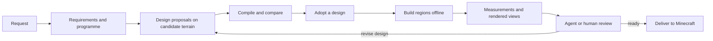

# EthosLM

EthosLM turns natural-language requests into Minecraft places. A language-model agent
interprets the request and designs the place; a Python library resolves its geometry and
builds the blocks. The same building forms, palettes and ground tools serve different
requests, from small settlements to large cities.

This is an experimental, agent-guided workflow. A terminal agent can do the design work
without a separate model API key. The CLI pauses at jobs requiring an answer and resumes
after the agent writes it.

## How it works, end to end


```mermaid
flowchart LR
    A[Request] --> B[Requirements and programme]
    B --> C[Design proposals on candidate terrain]
    C --> D[Compile and compare]
    D --> E[Adopt a design]
    E --> F[Build regions offline]
    F --> G[Measurements and rendered views]
    G --> H[Agent or human review]
    H -->|revise design| C
    H -->|ready| I[Deliver to Minecraft]
```

1. **Understand the request.** Interpretation records requirements such as setting,
   scale, functions and relationships. The agent writes a *programme*: what the place
   contains and how its parts relate. A reference job supplies evidence when a named
   place, tradition or uncertain design decision needs it.
2. **Design on real terrain.** An atlas reads heights, water and biomes from an existing
   save. The agent sees candidate sites, the available building forms and supported
   layout patterns, then proposes designs with boundaries, streets, districts, landmarks,
   ground policies and palettes. Walls and monumental centres are optional.
3. **Resolve and compare.** The compiler turns each proposal into concrete streets, lots,
   compounds and ground treatments. It uses building dimensions and site conditions,
   renders plan previews and reports capacity, earthwork and unresolved findings. An
   agent compares those results and adopts or revises a design.
4. **Construct.** Reusable building types emit structures into bounded regions. Ground,
   streets, buildings and landscape are assembled from the resolved design. Cached region
   builds can be reused when their inputs are unchanged. Build records include failures
   and measurements of supported features.
5. **Inspect and iterate.** Rendered views show the actual generated blocks. The supervising
   agent or a person reviews them and directs any further design work. The CLI currently
   stops after building and rendering; it does not automatically conduct this entire
   quality loop. `DESIGNED` means built offline, not visually approved.
6. **Deliver.** Once reviewed, the built region changes are written through GDMC-HTTP into
   a separate Minecraft save. Delivery tracks confirmed writes so interrupted work can
   be retried. `DELIVERED` describes the write, not the quality of the place.

## Run it

Use Python 3.12 or newer and a Minecraft Java save with generated terrain. Keep that save
as the unaltered baseline; the initial build happens offline.

```sh
python3 -m venv .venv
.venv/bin/python -m pip install -r requirements.txt
.venv/bin/python -m pip install --no-deps gdpc==8.1.0
scripts/ethoslm doctor --world /path/to/save
scripts/ethoslm start "Build a small sandstone oasis village with flat-roofed homes, shaded lanes and gardens around a pool of water." \
    --name oasis --world /path/to/save
```

Ask your terminal agent to follow the jobs that `status` reports: **read** the named
prompt, inspect its referenced maps or images, **write** the requested JSON answer, then
resume. A person can supply the same answers. Missing or invalid answers keep the run
waiting with a reason; a failed build is reported as blocked.

```sh
scripts/ethoslm status oasis
scripts/ethoslm resume oasis
scripts/ethoslm views oasis --move
```

State lives in `out/oasis/`, the terrain atlas in `out/oasis-atlas/`, and rendered views
in `out/oasis/design/views/`. `--move` adds a short camera animation and in-game poses.
Review the result before delivering it.

Start a Minecraft server with GDMC-HTTP on a **copy** of the baseline save. The server
at `--host` must serve the directory named by `--save`; never open one save in two servers.
`scripts/server.sh` is an optional helper (`ETHOSLM_SERVER_DIR` selects its directory).

```sh
scripts/ethoslm deliver oasis --save /path/to/save-copy --host http://localhost:9000
scripts/ethoslm deliver oasis --save /path/to/save-copy --host http://localhost:9000 --yes
```

Without `--yes`, the command describes the write. With it, delivery snapshots the save,
writes the regions and prints a location to visit. No Minecraft server is needed for the
earlier offline construction and rendering steps.

`ETHOSLM_PYTHON` selects another interpreter; `ETHOSLM_MC_JAR` supplies client textures
for the renderer. On NixOS, set `ETHOSLM_LIBRARY_PATH` or put native-library paths in an
untracked `.env`. `models.json` configures API routing for supported jobs; the design
workflow still needs a supervising agent.

## Current scope

The system has built a large city and a contrasting small settlement. Its strongest
composers cover housing rows, courtyard neighbourhoods, estates, fields and monumental
compounds. Small-settlement composition currently uses concentric lanes and spokes, with
one dwelling form per zone. Functional variety and other street organisations are limited;
different dimensions or seeds alone do not make a convincing neighbourhood. Semantic and
visual fidelity need review, even when a build passes its construction checks.

The older place-planning path also remains in the codebase; the CLI uses the newer design
and region-building path. These are not yet fully unified.

## Code and offline checks

| Location | Responsibility |
| --- | --- |
| `src/ethoslm/cli.py`, `pipeline/` | Commands, staged jobs and execution |
| `src/ethoslm/citydesign.py`, `cityresolve.py` | Design contract and spatial compiler |
| `src/ethoslm/designground.py`, `construction.py` | Ground treatment and building realization |
| `types/`, `voices/` | Reusable building forms and material palettes |
| `fixtures/` | Small terrain samples and plans for tests and the offline example |
| `out/`, `run/` | Generated state and worlds; excluded from version control |

After installation, try a recorded plan without a server or your own save:

```sh
.venv/bin/python scripts/round.py rounds/example.json --dry-run --stage parts,finish,lint
```

See [TESTING.md](TESTING.md) for test exclusions and conditional skips, and
[fixtures/README.md](fixtures/README.md) for the retained offline inputs.

MIT licence: [LICENSE](LICENSE).
